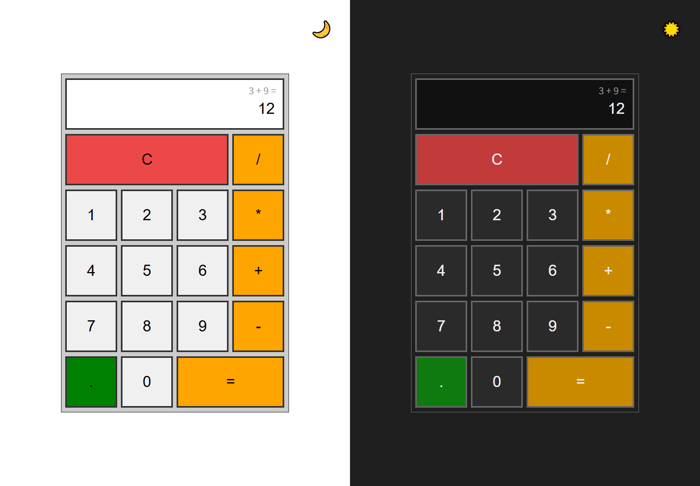

# Calculator (React + TypeScript)

React와 TypeScript를 사용해 구현한 계산기 프로젝트입니다.  

사칙연산과 소수점 계산을 지원하며, 키보드 입력과 다크 모드, 스크린리더 접근성을 고려하여 구현했습니다.

이 프로젝트는 상태 설계, 입력 처리 로직, 접근성 개선을 학습하고 정리하기 위한 개인 학습용 프로젝트입니다.

 

 

## 주요 기능

- 사칙연산(+ / − / × / ÷) 및 소수점 계산
- `=` 반복 입력 시 마지막 피연산자를 기준으로 재계산
- 마우스 및 키보드 입력 지원
- 다크 모드 전환
- 스크린리더 접근성 고려

 

## 기술 스택

- React
- TypeScript
- Decimal.js

 

## 동작 예시

- `8 ÷ 0 =` → `0으로 나눌 수 없습니다`
- `0 → 5` 입력 시 `05`가 아닌 `5`로 치환
- `=` 반복 입력 시 마지막 연산 기준으로 결과 재계산
- `Backspace` 입력 시 마지막 자리 삭제
- `Escape` 입력 시 전체 초기화

 

## 구현 포인트

### 상태 설계

계산기 입력 흐름을 하나의 상태 객체로 관리합니다.

- `currentNumber`: 현재 화면에 표시되는 값
- `previousNumber`: 이전 피연산자
- `operation`: 선택된 연산자
- `lastOperand`: `=` 반복 입력을 위한 마지막 피연산자
- `isNewNumber`: 새 숫자 입력 여부 판단

입력 방식(마우스/키보드)에 관계없이 동일한 상태 전이 로직을 사용하도록 구성했습니다.

 

### 입력 처리

- 숫자 입력, 연산자 입력, 특수 입력(초기화·삭제)을 분리해 처리
- 중복되는 조건 로직은 하나의 분기로 정리해 가독성을 유지
- 화면 값은 문자열로 관리하고, 계산 시에만 수치 연산을 수행

 

### 접근성 고려

- 화면 값이 변경될 때 스크린리더가 읽을 수 있도록 라이브 영역을 사용
- `*`, `/` 같은 기호 버튼에 `aria-label`을 지정