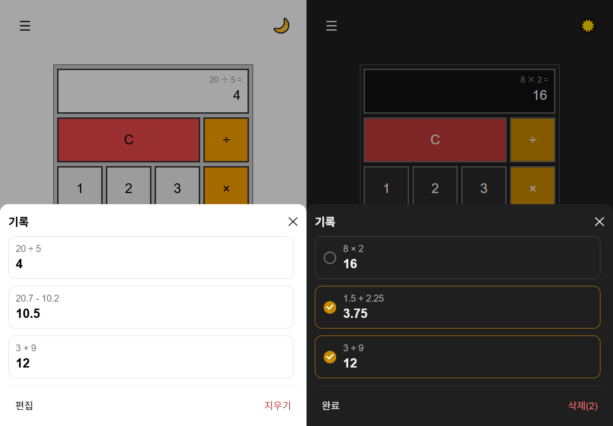
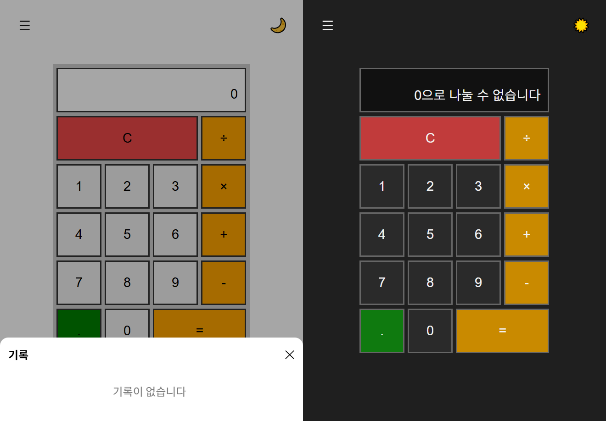

# Calculator (React + TypeScript)

React와 TypeScript로 구현한 계산기 프로젝트입니다.

사칙연산과 소수점 계산을 기본으로,
키보드 입력, 다크 모드, 연산 기록 패널, 접근성 대응 등을 구현했습니다.

이 프로젝트는 상태 설계, 입력·이벤트 처리, UI 상태 관리를 학습하고 정리하기 위한 개인 프로젝트입니다.

 

## 📸 스크린샷

  
<b>라이트 모드 / 다크 모드</b>

   
  

 

  
<b>히스토리 패널 기본 / 편집</b>

   
  

 

  
<b>히스토리 없는 상태 / 예외</b>

   
  

 

## 🚀 주요 기능

- 사칙연산(+ / − / × / ÷) 및 소수점 계산
- `=` 반복 입력 시 마지막 연산을 기준으로 재계산
- 마우스 / 키보드 입력 지원
- 다크 모드 / 라이트 모드 전환
- 상단 연산식 표시 (`3 + 9 =`)
- 연산 기록(히스토리) 패널
    - 기록 불러오기
    - 전체 삭제
    - 편집 모드에서 선택 삭제
- 예외 처리
    - 0으로 나누는 경우 오류 메시지 표시
    - 잘못된 입력 흐름 방지
- 스크린리더 접근성 고려

 

## 🛠️ 기술 스택

- React
- TypeScript
- Decimal.js

 

## 🧪 동작 예시

- `8 ÷ 0 =` → `0으로 나눌 수 없습니다`
- `0 → 5` 입력 시 `05`가 아닌 `5`로 치환
- `=` 반복 입력 시 마지막 연산 기준으로 결과 재계산
- `Backspace` 입력 시 마지막 자리 삭제
- `Escape` 입력 시 전체 초기화

 

## 🧩 구현 포인트

### 1) 상태 설계

계산기 입력 흐름을 하나의 상태 객체로 관리합니다.

- `currentNumber`: 현재 화면에 표시되는 값
- `previousNumber`: 이전 피연산자
- `operation`: 선택된 연산자
- `lastOperand`: `=` 반복 입력을 위한 마지막 피연산자
- `isNewNumber`: 결과 확정 이후 새 숫자 입력 여부

입력 방식이나 입력 경로에 관계없이,
동일한 상태 전이 규칙을 거치도록 구성했습니다.

 

### 2) 연산 로직 분리

연산 처리를 이벤트 핸들러 내부에서 직접 수행하지 않고,

이전 상태(`prev`)와 입력값을 받아 다음 상태를 반환하는 순수 함수 형태로 분리했습니다.

이 구조를 통해

- 버튼 클릭
- 키보드 입력
- 히스토리 복원

서로 다른 입력 진입점에서도 동일한 연산 규칙을 재사용할 수 있도록 했습니다.

 

### 3) 입력 처리 및 이벤트 구조

- 숫자 / 연산자 / 특수 입력(C, 삭제 등)을 역할별로 분리
- 키보드 이벤트는 `useEffect`에서 한 번만 등록
- 상태 변경은 `setState(prev => …)` 패턴을 사용해 최신 상태 기준으로 처리

이 방식으로 이벤트 처리의 안정성을 확보하면서도, 불필요한 훅 사용은 최소화했습니다.

 

### 4) 히스토리와 UI 상태 관리

연산 기록 기능을 추가하면서,
히스토리 패널에는 서로 다른 두 가지 동작 모드가 필요해졌습니다.

- 일반 모드: 기록 클릭 시 계산 결과 불러오기
- 편집 모드: 기록 선택 / 선택 해제 / 선택 삭제

UI 모드 상태를 분리해 관리해, 클릭 동작의 의미를 구분했습니다.

 

### 5) UX 및 예외 상태 처리

- 히스토리가 없는 경우: `기록이 없습니다` 안내
- 잘못된 연산(0으로 나누기): 결과 영역에 오류 메시지 표시
- 상태가 섞이지 않도록 입력 흐름을 제한

 

### 6) 접근성 고려

- 화면 값이 변경될 때 스크린리더가 인식할 수 있도록 라이브 영역 사용
- `×`, `÷` 버튼에 `aria-label`을 지정
- 히스토리 패널은 모달 성격을 갖도록 접근성 속성 적용

 

## 📝 참고

- React 학습 과정에서 [책](https://product.kyobobook.co.kr/detail/S000217326306)에 수록된 계산기 예제를 바탕으로 확장했습니다.